# Hesionalis

Hesionalis is a full-stack, responsive website built for a fictional tattoo business for educational purposes only.

It provides the user value in learning about the business and the services it provides. It has a booking page which allows users to create an account and then book, view and delete appointments.

# Overview

Hesionalis is a responsive, mobile-first build website. It is compatible with all current major browsers. The website was built using Bootstrap and the Django Framework. It gives users the ability to register for an account and book appointments.

# User stories

This project was created using agile methodology. Github issues were used to record user stories. The MoSCoW Method of Prioritisation was also used, each user story was tagged as 'must-have', 'should-have' or 'could-have'.

**Epic 1: Set up**
- Install Django and supporting libraries
- Create Django project and app

**Epic 2: First deployment**
- Create Heroku app and postgreSQL database
- Connect to Cloudinary
- Deploy

**Epic 3: Models**

**Epic 4: User registration and authentication**
- Registration
- Login
- Logout

**Epic 5: Profile**
- View profile
- Edit profile

**Epic 6: Appointments**
- Book an appointment
- View appointment
- Delete appointment
- Edit appointment

**Epic 7: Documentation**

I liked using this methodology, makes you keep your eyes on your progress and provides satisfaction from moving user stories into 'done' section.

# User Experience (UX)

## Website goals
Hesionalis aims to offer users great experience getting their tattoos. It has home page with services listed, artists page and styles page so that the user can see if hesionalis fits their vision or not, and having some nonbinary people on team, it provides a safe space for queer people. The target audience is people from 18 years old.

## User Stories

User stories revolved around three groups (developer, owner and user) to tick off their basic needs with this project.

**Business owner:**
- Admin panel
- Accept or reject appointments
- Encouragement to book an appointment

**Developer:**
- Installation
- Deployment
- Admin panel
- Models

**User:**
- Home, artists, styles, FAQ pages
- Alert messages
- Register, Login, Logout
- Profile
- Appointment

# Structure

The structure is simple and responsive. 

The navigation menu displays logo and links to other pages. Links become a hamburger icon on smaller screens. The navigation is repeated on all pages.

The footer provides social links which open in a new tab, location, open times, phone number and email, and links to other pages.

The home page displays information about the parlor, services hesionalis provides, founders and encouragement to book an appointment.

The artists page displays artists, their names, skills and gender.

The styles page displays parlor's portfolio with style's name.

Registration, login and logout pages can be accessed in the navigation menu. 

Profile page, which is only accessible to logged in users, contains first and last name fields to alter and a link below to change password.

The booking page can be accessed on almost every page in main body of template and in the navigation menu and footer. It contains booking form and redirects to appointments.

The appointment page displays all appointments booked and a button to delete or edit each of them. If appointment was accepted or rejected, then user doesn't have an option to edit it. If there are no appointments, it is shown too.

The database schema

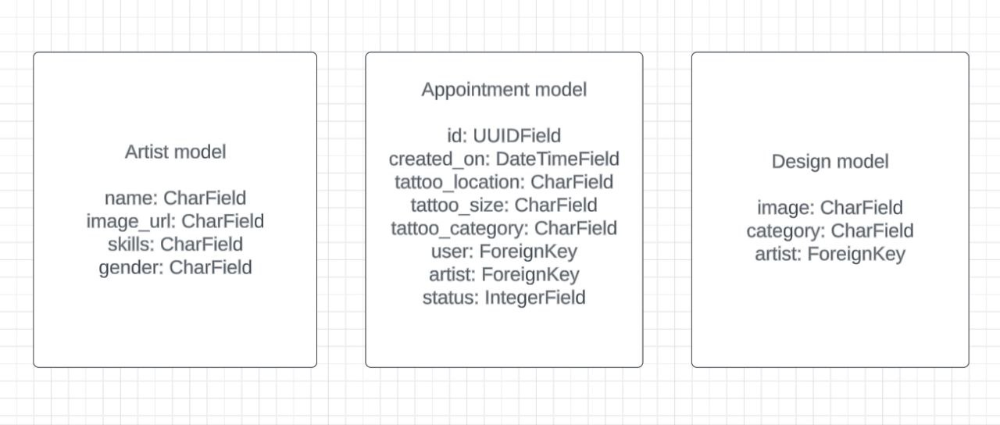

## Surface

I used four colors in different shades. Black, white, beige and purple.

Black was used as the main background and text color.

White was used for text color, particularly in navigation menu and footer.

Beige was used for background and text color.

Purple was used for buttons.

## Typography

Google Fonts League Spartan and Rubik were used to create this website.

## Icons

Font Awesome was used to add icons to the website, social icon in the footer and founder's social links, and services icons.

# Features

## Existing features

**Navigation menu**

Featured on all pages,links become a hamburger icon on smaller screens, includes links to:

- home page, accessible via logo;

- artists page;

- styles page;

- booking page;

- FAQ page;

- login page if not logged in;

- appointments page if logged in;

- profile page if logged in;

- logout if logged in.

**Footer**

Featured on all pages, includes:

- social links;

- links to other pages;

- location;

- open time;

- contact information.

**Home page**

Includes:

- photo of word tattoo in a heart;

- encouragement to book an appointment;

- three works done by top artists;

- services;

- founders.

Screenshots of home page

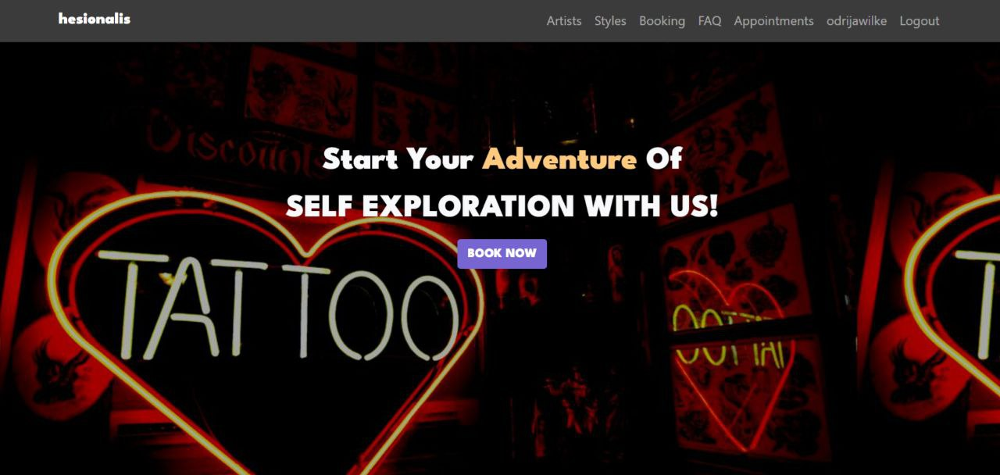

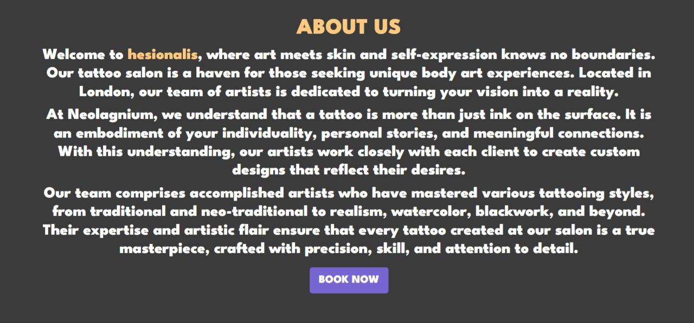

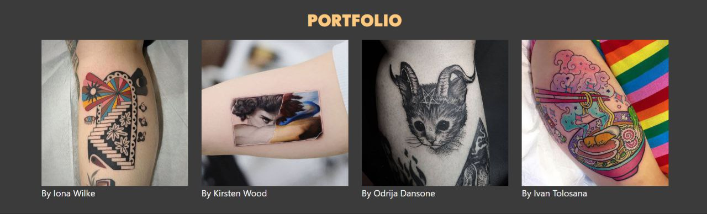

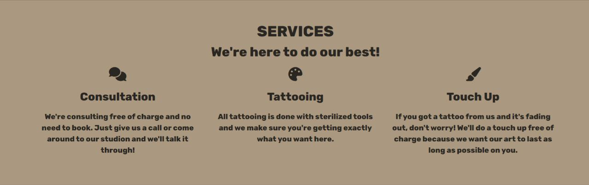

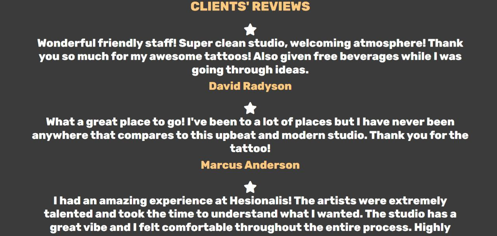

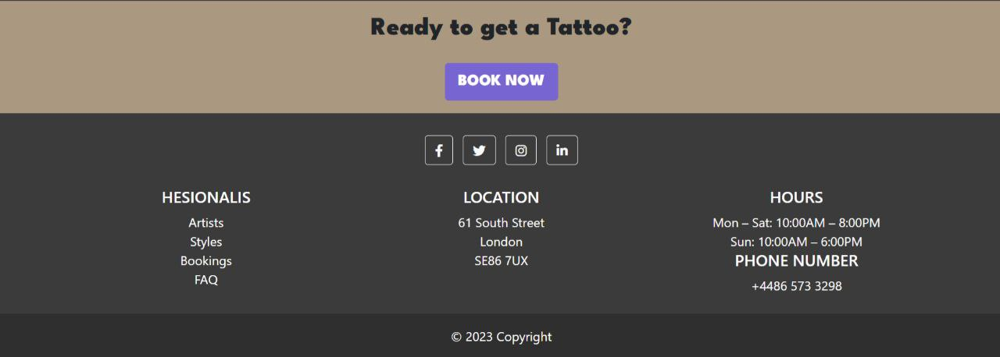

**Artists page**

Displays information about every artists: their name, main skill and gender with a link to booking under.

Screenshots of artists page

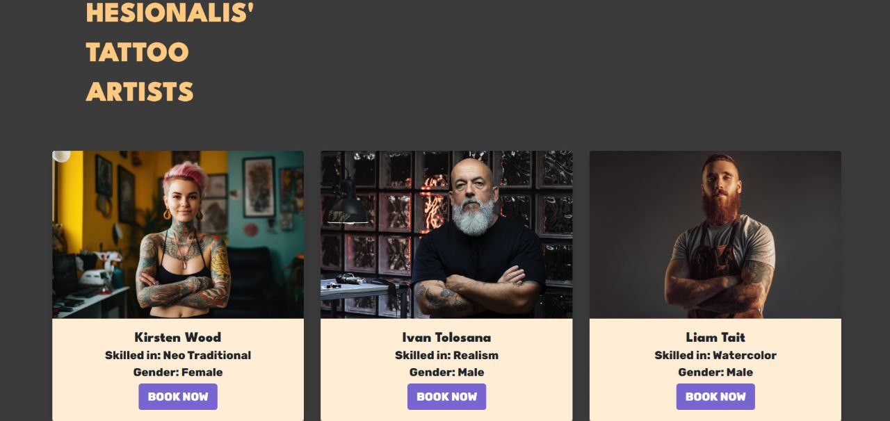

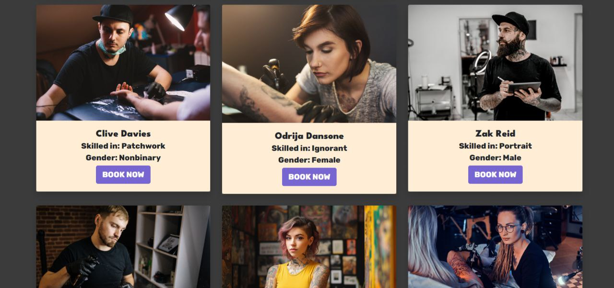

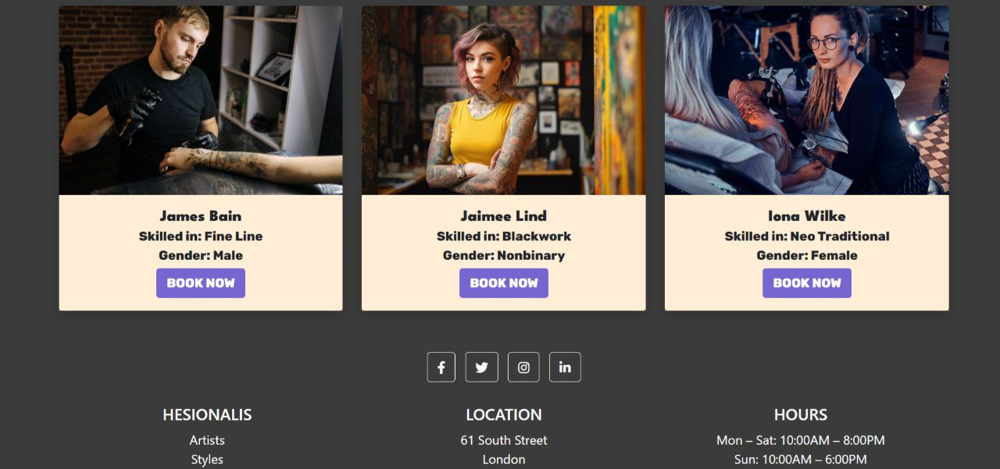

**Styles page**

Displays different tattoo styles done by hesionalis artists.

Screenshots of styles page

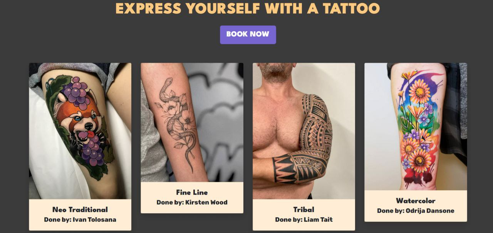

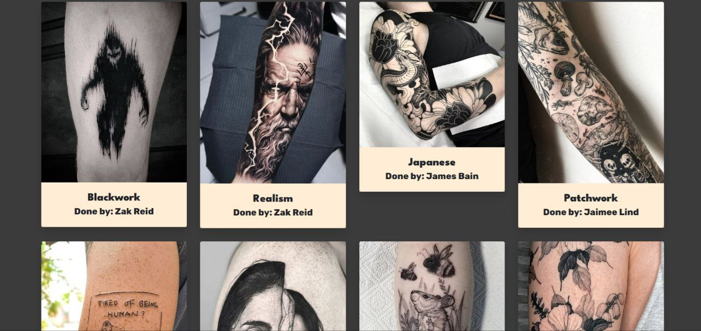

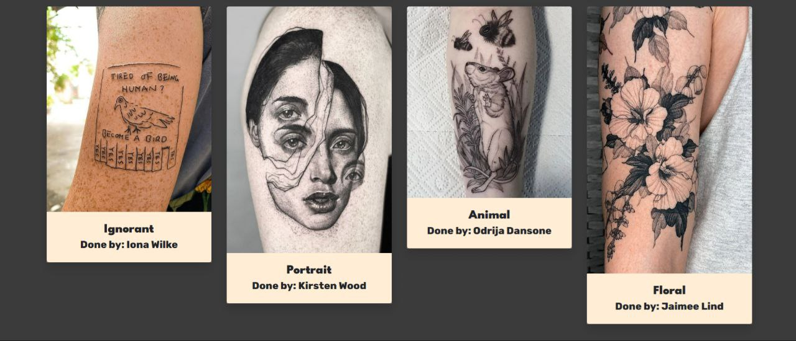

**FAQ page**

Displays most asked questions.

Screenshot of FAQ page

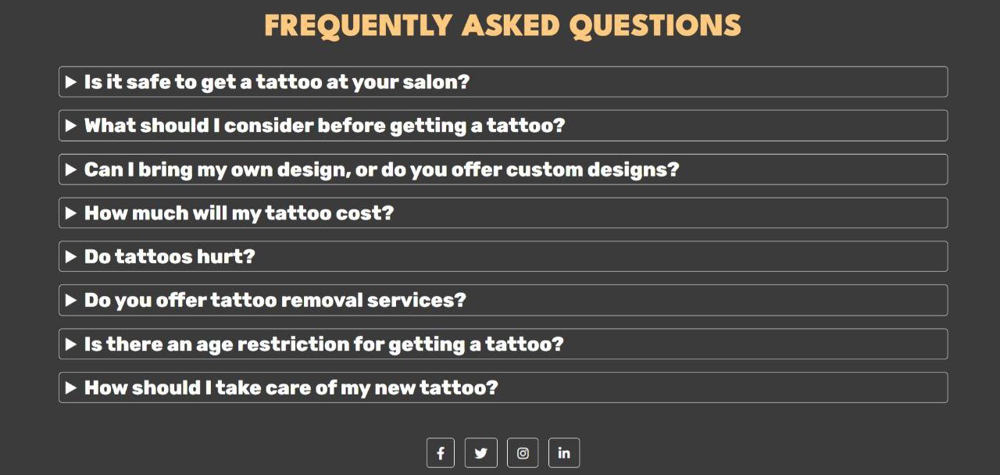

**Registration**

Redirects to login page after completing.

Registration form includes:

- first name;

- last name;

- username;

- email;

- password.

Screenshot of registration page

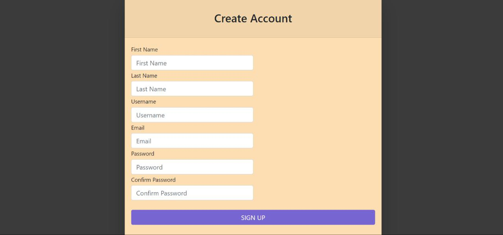

**Login**

Redirects to home page after completing.

Login form includes username and password.

Screenshot of login page

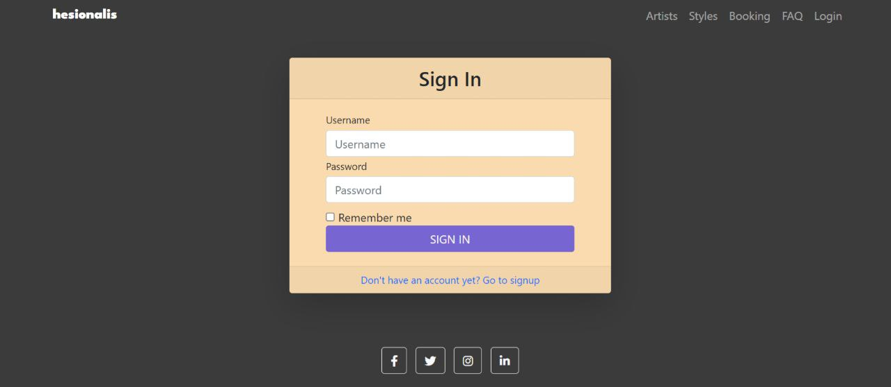

**Logout**

Logs out the user and displays a success message, appointment and profile links dissapear, login link appears.

**Booking**

Redirects to appointments after completing, a success message saying that hesionalis staff will be in touch soon pops up. The reason for not giving users the ability to pick time is because of tattoo appointment's unpredictability, session times vary depending on tattoo style and size, as well as the chosen body part because a client can ask for numbing cream to be applied and this can take up to 30 minutes to do. In the end I decided it's better for staff to contact the client so they could provide more information that's needed to know how much their tattoo appointment will last.

Booking form includes:

- artist;

- tattoo location;

- tattoo size;

- tattoo category.

Screenshot of booking page

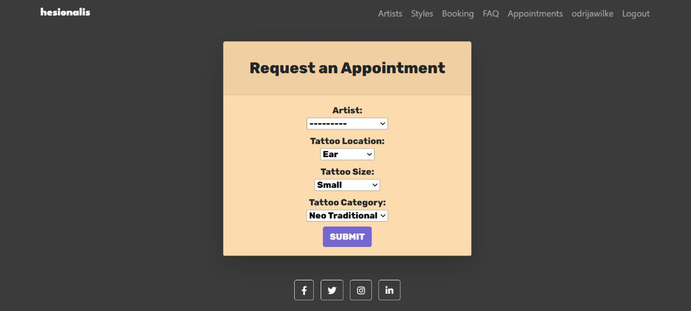

**Appointments**

Displays all appointments and their information, such as:

- artist;

- tattoo location;

- tattoo size;

- tattoo category;

- created on time;

- status of booking.

Screenshot of appointments page

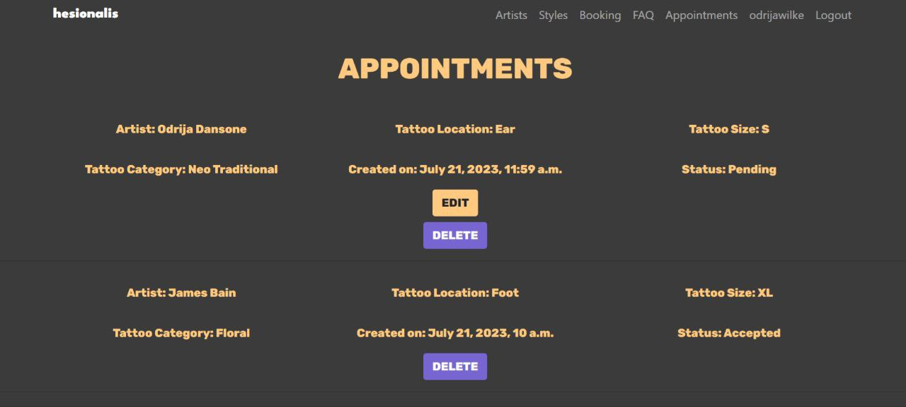

**Edit appointment**

Includes all the same fields as appointment form but with prepopulated fields.

Screenshot of edit appointment page

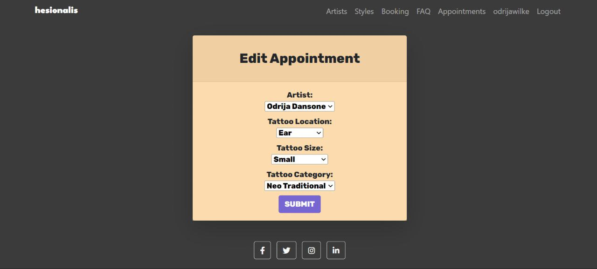

**Profile**

Displays first and last name to the user so they can edit them. Includes a link below to change password.

Screenshots of profile page

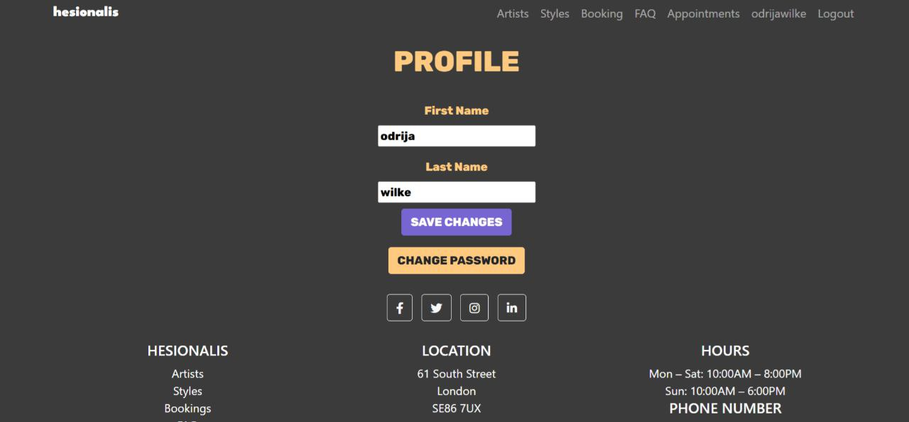

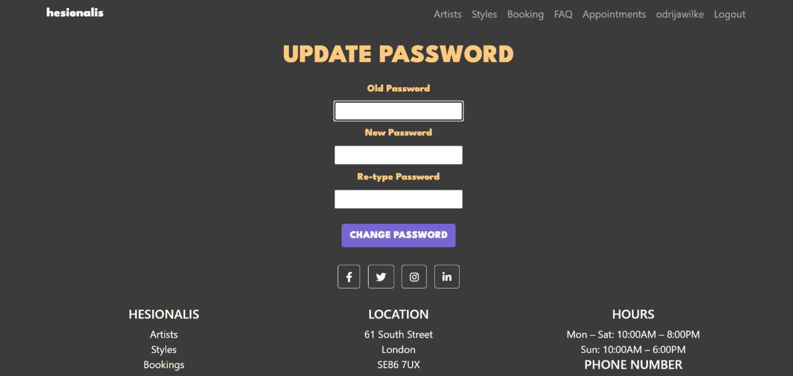

## Future features

- phone number in registration. I couldn't find a way to fully validate phone number field without using a library that needs a lot of other libraries installed beforehand.

- automated email messages for registration and appointment booking.

- forgot/reset password feature.

# Technologies used

## Languages

HTML

CSS

Python

## Libraries and frameworks

Django - Python Web Framework

Gunicorn - Python WSGI HTTP server

PostgreSQL - Database system

Psycopg2 - PostgreSQL database adapter for Python

Cloudinary - Media file storage

Heroku - Hosting apps service

ElephantSQL - PostgreSQL database hosting service

SQLite3 - Database provided by Django

Bootstrap - Framework for creating responsive websites

## Tools

Gitpod - Cloud development environment

Github - Cloud based git repository

W3C Validator - HTML Validator

W3C CSS Validator - CSS Validator

Code Institute Python Linter - Python Validator

Chrome Devtools - Web Developer Tools

Google Fonts - Fonts

Font Awesome - Icons

LucidChart - Diagram

Freepik - Pictures

# Testing

# Bugs

**First deployment bug**

Heroku showed an error messages, saying the app couldn't be deployed due to issues. I checked the set up code and nothing was wrong so I checked config vars and noticed I didn't add disable collect static config var. The app was deployed successfully after adding it.

**Edit profile and password links not working**

Checked StackOverflow on this issue and it was resolved after moving the urls in urls.py to the top.

This question on StackOverflow helped me: [405 Error - StackOverflow](https://stackoverflow.com/questions/22983222/405-post-method-not-allowed#:~:text=%22Raised%20when%20an%20incoming%20request,handler%20method%20on%20the%20view.%22&text=Basically%20that%20error%20means%20that,are%20calling%20the%20proper%20one.)

**Passing on a primary key to a field in a model and then deleting it**

Originally I had another repository for this project but then I passed on a primary key to a model when I tried using id for appointments but couldn't, tried managing appointments using a primary key but didn't manage so I tried removing the primary key and migrating the changes. The terminal printed out that the field is supposed to have a default and asking for it, I didn't know what default to give to it. I googled it and all answers were saying that you have to answer '', I did it and the database crushed. I tried reversing the last migration but I didn't manage to do it. In the end I decided to create a new repository. 

You can find the old repository [here](https://github.com/pozhara/hesionalis)

# Deployment

Deployed early on to avoid any issues at the end of the project.

## First deployment

### Set up

- Create the Heroku app

- Create postgreSQL database

- Create the env.py file

- Modify settings.py

- Connect database to Heroku

- Set up Cloudinary

- Set up templates directory

- Add Heroku hostname to allowed hosts

- Create Procfile

### Deploy

- Click on the app and deploy

- Choose Github for deployment method

- Select your repository

- Click 'Deploy'

# Credits

## Code

Registration, Login and partially Profile: [Django - Update User Profile](https://dev.to/earthcomfy/creating-a-django-registration-login-app-part-i-1di5)

Edit appointment adapted from [Update a Model Object With a ModelForm](https://openclassrooms.com/en/courses/6967196-create-a-web-application-with-django/7349667-update-a-model-object-with-a-modelform)

Took and adapted parts from this template into my ones: [Agency - Start Bootstrap](https://startbootstrap.com/theme/agency)

Success and error messages: [StudyGyaan](https://www.youtube.com/watch?v=VIx3HD2gRWQ)

Sources I referred to a lot:

[Bootstrap Documentation](https://getbootstrap.com/docs/4.1/getting-started/introduction/)

## Media

All pictures are from [Freepik](https://www.freepik.com/)
